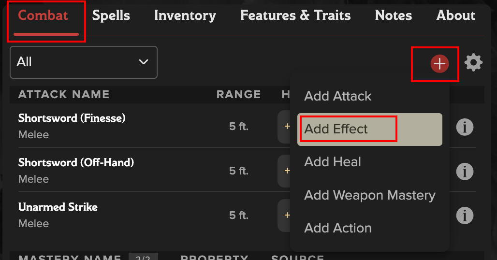
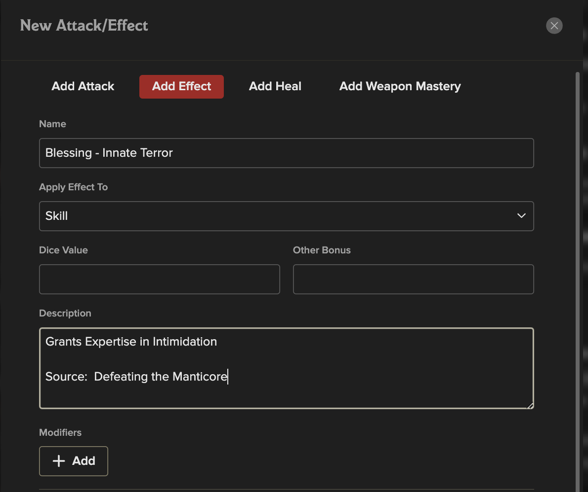
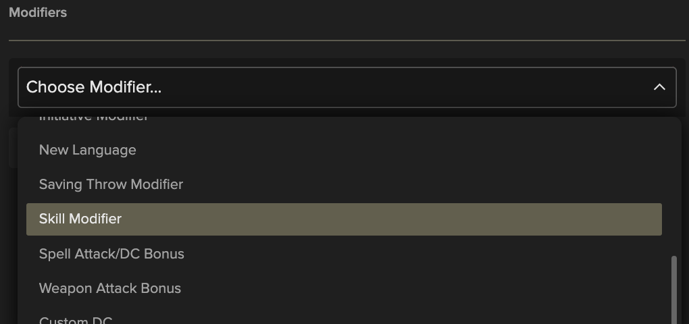
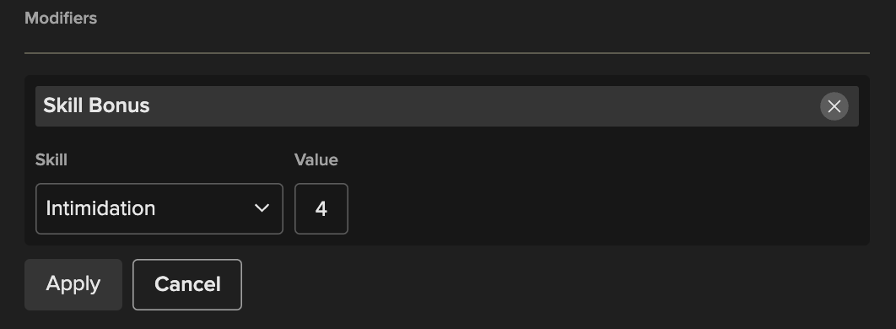
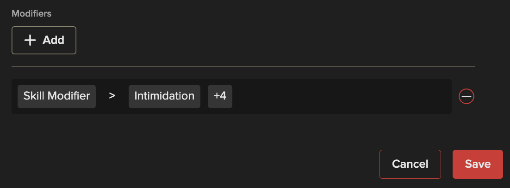
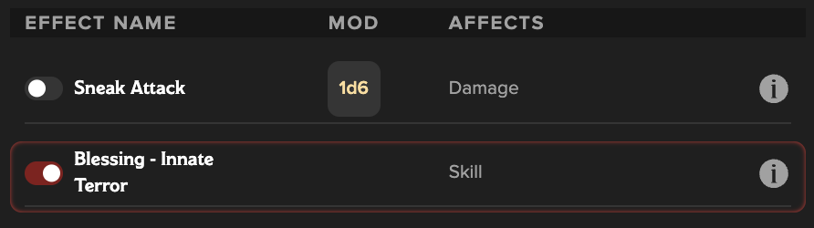

# Blessing Effect

## Introduction

### Motivation

We got our first "optional" Blessing and I wanted to find a way to set these up to make them very easy to use in the character sheet.  In this document I'm using the `Innate Terror` Blessing as my example, which grants `Expertise in Intimitation`

I took into account all of the following when figuring out where and how to setup my Blessings:
- We would only be able to have one active at a time
- We are able to change which one is active at each long rest
- I wanted to minimize what I may need to go change in my sheet, especially mid-session if I wanted to switch Blessings

### Solution

My approach was to use the `Effects` feature in the new sheets, which allow us to turn effect on/off with the ease of a toggle

### Limitations/Constraints
- I could only set it up with a fixed number added to a skill, so I will need to go edit the effect if/when:
  - My Training Level in Intimidation changes
  - My Proficiency Modifier changes

Besides those specific events, this solution should make Blessing selection super simple and hopefully future blessings will fit into the same system

## Create Effect: Blessing - Innate Terror

1. **Add New Effect**
    - On the **Combat** tab, click the **[+]** and select **Add Effect**
    - 

2. **Enter Effect Details**
    - Make sure the **Add Effect** is what's highlighted at the top
    - Apply Effect To: **Skill**
    - Enter the Name and Description.
    - Dice Value and Other Bonus can be left blank
    - 

3. **Add Modifier**
    - Click the **[+ Add]** Button under **Modifiers**
    - In the dropdwon, select **Skill Modifier**
      - *Note that once selected it will say* ***"Skill Bonus"***
    - 
    - Select the Skill **Intimidation**
    - Put in a **Value** that represents your current bonus needed to get your to Expertise
      - In my example, I am **Untrained** in Intimidation and my **Proficiency Bonus** is **2**, so I put the value as **4** which will grant me **+4 Intimidation** when I have this effect enabled
      - If I later become **Trained** or when my **Proficiency Bonus** goes up I will have to come back and manually change this, but only at those times
    - **Don't Forget to Click Apply**
      - This may not be obvious.  You can click **Save** on the whole Effect and it will look like it worked but if you did not Apply the modifier that part will not be saved
    - 
    - Once Applied, the Modifier should show and it's very clear what it's doing
      - You can see in this applied Modifier that it is clearly doing a **Skill Modification** to **Intimidation** of **+4**
    - 

4. **See New Effect**
    - The new Effect will appear on the **Combat** tab under the **Effects** Section along side any other effects that you may have available to you
    - 

## Results:

Now you should be able to freely toggle your Blessing on and off anytime you want to change which blessings are enabled, and you can quickly see on your sheet that you always have exactly one enabled, without ever needing to go manage specific stats or track those details elsewhere

### What it looks like:
| Effect Toggle | Skills Header | Intimidation Skill |
|--|--|--|
||||
||||

